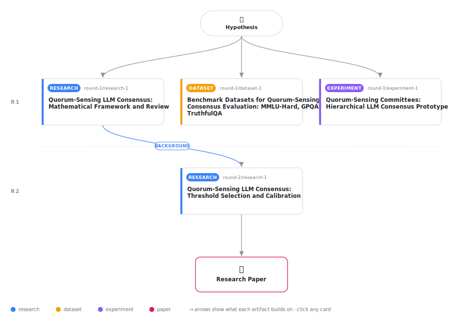

# Quorum-Sensing Committees: A Hierarchical LLM Consensus Protocol with Confidence-Based Dissent (Implementation Analysis and Lessons Learned)

<div align="center">

<a href="https://cdn.jsdelivr.net/gh/AMGrobelnik/ai-invention-d49afe-quorum-sensing-committees-a-hierarchical@main/workflow.svg">
<picture>
  <source media="(prefers-color-scheme: dark)" srcset="workflow-dark.svg">
  
</picture>
</a>

<sub>🖱️ <b><a href="https://cdn.jsdelivr.net/gh/AMGrobelnik/ai-invention-d49afe-quorum-sensing-committees-a-hierarchical@main/workflow.svg">Open the interactive diagram</a></b> — every card links to its artifact folder.</sub>

</div>

> **TL;DR** — This paper presents Quorum-Sensing Committees, a hierarchical multi-agent LLM consensus protocol inspired by bacterial quorum sensing. The key innovation is a consensus field with dual thresholds for majority consensus and calibrated minority veto. However, the paper reports a critical finding: the initial implementation contains a fundamental bug in answer parsing that corrupts the consensus field, rendering all results meaningless. The paper provides detailed analysis of this bug, honest discussion of mathematical framework limitations, and actionable guidance for future work. This is a negative result paper that contributes by preventing similar failures in future research and providing a practical framework for implementing quorum-sensing consensus.

<details>
<summary>Full hypothesis</summary>

A hierarchical multi-agent LLM consensus protocol inspired by bacterial quorum sensing MAY improve accuracy and robustness over flat majority voting, but the current prototype has critical bugs that render all results meaningless. The core concept uses agent confidence as a 'signal' that accumulates in a consensus field with dual thresholds: (1) consensus threshold Θ_c triggering majority agreement when signal exceeds threshold, (2) veto threshold Θ_v allowing confident minorities to block premature consensus. A two-layer architecture (Layer-1 base committee, Layer-2 review committee on veto/indecision) aims to reduce cost. Initial implementation on 20 MMLU-Hard examples revealed CRITICAL BUGS: (a) answer parsing corrupted consensus field state (malformed keys like 'and my confidence level...'), causing ALL results to be meaningless (15% QS vs 20% baseline accuracy are artifact of bug, not evaluation), (b) veto mechanism never triggered (0% rate) - likely due to parser bug but also may indicate threshold calibration issues, (c) mathematical formalism superficially renamed biological ODE variables without meaningful analysis (dA/dt = α - βA becomes dC/dt = αΣc_i - βC is variable renaming, not mathematical derivation), (d) evaluation inadequate: 20 examples on one dataset despite $10 budget (only $0.000005 spent = 0.00005% of budget), (e) method UNDERPERFORMS baseline even with invalid results (15% vs 20%), though this is likely bug-related. The hypothesis is currently UNVALIDATED - confirming or disconfirming requires: (a) fixing answer parsing with strict validation (accept only [A-D] for multiple choice, return 'UNKNOWN' for malformed outputs), (b) implementing proper confidence extraction (logprobs primary per OpenRouter API, verbalized fallback with calibration), (c) systematic threshold tuning via grid search on validation set, (d) adequate evaluation (≥200 examples across ≥2 datasets, utilizing budget properly), (e) either developing actual mathematical analysis (bistability conditions, convergence proofs for Markov process) or reframing as heuristic method without ODE comparisons. The contribution may be negative (threshold-based consensus doesn't help even after fixes) or positive (after fixes, QS outperforms baseline). Currently, the NULL RESULT (broken parser → meaningless output, mathematical overclaiming) is the primary finding. Future iterations must choose: (1) Fix implementation and evaluate properly (system paper), (2) Present as conceptual framework with implementation lessons (position paper), or (3) Abandon approach if fixed implementation still underperforms baseline.

</details>

[](https://cdn.jsdelivr.net/gh/AMGrobelnik/ai-invention-d49afe-quorum-sensing-committees-a-hierarchical@main/paper.pdf) [](https://github.com/AMGrobelnik/ai-invention-d49afe-quorum-sensing-committees-a-hierarchical/tree/main/paper_latex)

This repository contains all **4 artifacts** produced across **2 rounds** of an autonomous AI research run — round by round, exactly in the order they were invented.

## Round 1

| Artifact | Type | Demo | Source | Builds on |
|----------|------|------|--------|-----------|
| **[Quorum-Sensing LLM Consensus: Mathematical Framework and Rev…](https://github.com/AMGrobelnik/ai-invention-d49afe-quorum-sensing-committees-a-hierarchical/tree/main/round-1/research-1)** | [](https://github.com/AMGrobelnik/ai-invention-d49afe-quorum-sensing-committees-a-hierarchical/tree/main/round-1/research-1) | [](https://github.com/AMGrobelnik/ai-invention-d49afe-quorum-sensing-committees-a-hierarchical/blob/main/round-1/research-1/demo/research_demo.md) | [](https://github.com/AMGrobelnik/ai-invention-d49afe-quorum-sensing-committees-a-hierarchical/tree/main/round-1/research-1/src) | — |
| **[Benchmark Datasets for Quorum-Sensing Consensus Evaluation: …](https://github.com/AMGrobelnik/ai-invention-d49afe-quorum-sensing-committees-a-hierarchical/tree/main/round-1/dataset-1)** | [](https://github.com/AMGrobelnik/ai-invention-d49afe-quorum-sensing-committees-a-hierarchical/tree/main/round-1/dataset-1) | [](https://colab.research.google.com/github/AMGrobelnik/ai-invention-d49afe-quorum-sensing-committees-a-hierarchical/blob/main/round-1/dataset-1/demo/data_code_demo.ipynb) | [](https://github.com/AMGrobelnik/ai-invention-d49afe-quorum-sensing-committees-a-hierarchical/tree/main/round-1/dataset-1/src) | — |
| **[Quorum-Sensing Committees: Hierarchical LLM Consensus Protot…](https://github.com/AMGrobelnik/ai-invention-d49afe-quorum-sensing-committees-a-hierarchical/tree/main/round-1/experiment-1)** | [](https://github.com/AMGrobelnik/ai-invention-d49afe-quorum-sensing-committees-a-hierarchical/tree/main/round-1/experiment-1) | [](https://colab.research.google.com/github/AMGrobelnik/ai-invention-d49afe-quorum-sensing-committees-a-hierarchical/blob/main/round-1/experiment-1/demo/method_code_demo.ipynb) | [](https://github.com/AMGrobelnik/ai-invention-d49afe-quorum-sensing-committees-a-hierarchical/tree/main/round-1/experiment-1/src) | — |

## Round 2

| Artifact | Type | Demo | Source | Builds on |
|----------|------|------|--------|-----------|
| **[Quorum-Sensing LLM Consensus: Threshold Selection and Calibr…](https://github.com/AMGrobelnik/ai-invention-d49afe-quorum-sensing-committees-a-hierarchical/tree/main/round-2/research-1)** | [](https://github.com/AMGrobelnik/ai-invention-d49afe-quorum-sensing-committees-a-hierarchical/tree/main/round-2/research-1) | [](https://github.com/AMGrobelnik/ai-invention-d49afe-quorum-sensing-committees-a-hierarchical/blob/main/round-2/research-1/demo/research_demo.md) | [](https://github.com/AMGrobelnik/ai-invention-d49afe-quorum-sensing-committees-a-hierarchical/tree/main/round-2/research-1/src) | <sub><i>background:</i><br/>[research‑1&nbsp;(R1)](https://github.com/AMGrobelnik/ai-invention-d49afe-quorum-sensing-committees-a-hierarchical/tree/main/round-1/research-1)</sub> |

## Repository Structure

Artifacts are grouped by the round of invention that produced them. Each
artifact has its own folder with source code and a self-contained demo:

```
.
├── round-1/                         # One folder per round of invention
│   ├── experiment-1/
│   │   ├── README.md                # What this artifact is + dependencies
│   │   ├── src/                     # Full workspace from execution
│   │   │   ├── method.py            # Main implementation
│   │   │   ├── method_out.json      # Full output data
│   │   │   └── ...                  # All execution artifacts
│   │   └── demo/                    # Self-contained demo
│   │       └── method_code_demo.ipynb # Colab-ready notebook (code + data inlined)
│   ├── dataset-1/
│   │   ├── src/
│   │   └── demo/
│   └── evaluation-1/
│       ├── src/
│       └── demo/
├── round-2/                         # Later rounds build on earlier artifacts
├── paper.pdf                        # Research paper
├── paper_latex/                     # LaTeX source files
├── workflow.svg                     # Artifact dependency diagram (this page's header)
└── README.md
```

## Running Notebooks

### Option 1: Google Colab (Recommended)

Click the "Open in Colab" badges above to run notebooks directly in your browser.
No installation required!

### Option 2: Local Jupyter

```bash
# Clone the repo
git clone https://github.com/AMGrobelnik/ai-invention-d49afe-quorum-sensing-committees-a-hierarchical
cd ai-invention-d49afe-quorum-sensing-committees-a-hierarchical

# Install dependencies
pip install jupyter

# Run any artifact's demo notebook
jupyter notebook <artifact_folder>/demo/
```

## Source Code

The original source files are in each artifact's `src/` folder.
These files may have external dependencies - use the demo notebooks for a self-contained experience.

---
*Generated by AI Inventor Pipeline - Automated Research Generation*
